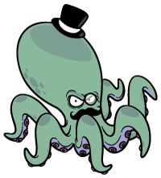
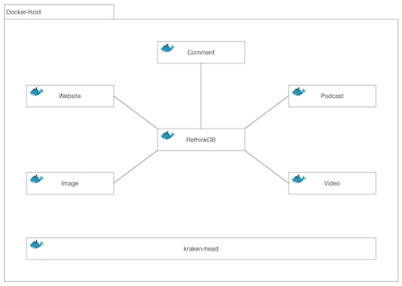

<div style="text-align: center">
	
	<h1>Awesome Knowledge Kraken</h1>
</div>

---

# Architektur
Der Awesome Knowdlege Kraken fungiert als Wissensmanagementsystem, welches diverse Wissens- / Informationsquellen verwendet. Jede der Quellen wird im Folgenden auch als Tentakel bezeichnet. Jede Tentakel läuft als Microservice in einem eigenen Doker-Container, welche über Docker-Compose Orchestriert werden.

##	Servicestruktur
  

Die obige Abbildung zeigt die grobe Architektur des Awesome Knowledge Kraken. Jede Komponente des Systems soll als eigenständiger Microservice in einer Docker-Umgebung lauffähig sein. Jede Komponente stellt also einen eigenen Service dar, welcher gemäß des Separation of Concerns Paradigmas genau für eine Aufgabe entwickelt wird.

### kraken-head (User Interface)
Zentrale Komponente, an denen sich Tentakeln anmelden müssen, um vom Benutzer verwendet werden zu können und auf der Oberfläche als Link aufzutauchen. Übernimmt zudem Statusabfragen an die angemeldeten Tentakeln, sodass festgestellt werden kann, dass und wenn ein Service ausgefallen ist, dieser als nicht verfügbar angezeigt wird.

#### Routes
```
POST	/register
		Register a new route
		{
			prefix: '/<service-name>',
  			host: '<service-host>',
  			port: '<service-port>'
		}

GET		/status
```

#### kraken-brain (WIP)
Dies ist die zentrale Datenhaltung des Kraken. Hier läuft die Datenbank mit entsprechenden Interfaces, welche den Zugriff auf die persistierten Daten enthalten. Das Konzept sieht einen Event-basierten Ansatz vor, welcher sich auf die RethinkDB stützt. 

### kraken-website-tentacle (WIP)
Dieser Service erlaubt unter Angabe einer URL das Erzeugen von Screenshots / Thumbnails der jeweiligen Webseite. Ebenfalls möglich über diesen Service ist es, die Webseite zu „snappen“, was eine lauffähige, lokale Kopie einer URL erzeugt.


#### Routes
```
POST	/websites/screenshots

GET		/websites/screenshots/:url

POST	/websites/snaps

GET		/websites/snaps/:url
```
### kraken-podcast-tentacle (WIP)
Dieser Service nimmt eine Podcast-Feed-URL entgegen, welche regelmäßig auf neue Folgen geprüft wird. Es werden zentrale Informationen abgespeichert (Name des Podcasts, Titelbild, Homepage-URL und Feed-URL). Diese Informationen werden verwendet, um sie auf regelmäßige Updates zu prüfen und auch in optisch ansprechender Form auf einer Webseite präsentieren zu können.


#### Routes
```
POST	/podcasts

GET		/podcasts

GET		/podcasts/:id
```

### kraken-image-tentacle (PLANNED)
Dieser Service macht eine lokale Kopie des Bildes, welches gespeichert werden soll.

### kraken-video-tentacle (PLANNED)
Dieser Service macht Videos lokal verfügbar.

### kraken-comment-tentacle (PLANNED)
Dieser Service erlaubt es die gesammelten Daten zu kommentieren und darüber zu disktuieren. Dieser Service soll als Social-Plugin ähnlich des Facebook-Kommentar-Plugins funktionieren, welcher beliebig eingebunden werden kann.


